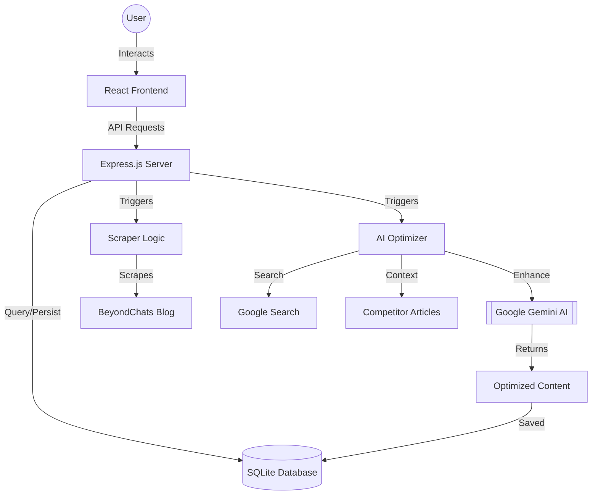

# BeyondChats Blog Insights - Full Stack Application

A professional full-stack application designed to scrape, optimize, and display articles from the BeyondChats blog.

## 🚀 Key Features
- **Smart Scraper**: Automatically fetches the 5 oldest articles from BeyondChats blogs.
- **AI Optimization**: Uses Google Gemini to rewrite articles for better flow, formatting, and depth, while citing top-ranking competitors.
- **RESTful API**: A complete Node.js/Express backend for managing articles.
- **Premium UI**: A responsive ReactJS frontend built with TailwindCSS, Framer Motion, and Lucide React.

## 🏗️ Architecture & Data Flow



### Data Flow Breakdown
1. **Scraping**: The backend fetches articles via `cheerio`. If they are new, they are stored in SQLite.
2. **Optimization**: The `optimizer.js` script picks an article, searches Google for competitors, scrapes their content, and sends everything to Gemini to generate an "Optimized" version.
3. **Frontend**: The React app fetches the combined list. Optimized articles are flagged and displayed with a premium "AI Optimized" badge.

## 🛠️ Local Setup Instructions

### 1. Prerequisites
- Node.js (v18 or higher)
- npm or yarn

### 2. Backend Setup
```bash
# Navigate to the root directory
cd AssignmentBeyondChats

# Install dependencies
npm install

# Setup environment variables
# Create a .env file and add your Gemini API Key
echo "GEMINI_API_KEY=your_key_here" > .env
```

### 3. Frontend Setup
```bash
# Navigate to the frontend directory
cd frontend

# Install dependencies
npm install

# Start the dev server
npm run dev
```

### 4. Running the Project
1. Start the backend server: `node server.js` from the root.
2. Start the frontend: `npm run dev` from the `frontend/` folder.
3. Access the dashboard at `http://localhost:5173`.

## 📂 Project Structure
- `/`: Express.js backend, Scraper, and AI Optimizer.
- `/frontend`: ReactJS application.
- `db.js`: Database configuration.
- `articles.db`: SQLite database file.

## 🔗 Submission Details
- **Phase 1**: Blog Scraper & CRUD APIs (Done)
- **Phase 2**: AI-Powered Optimization (Done)
- **Phase 3**: ReactJS Frontend (Done)
